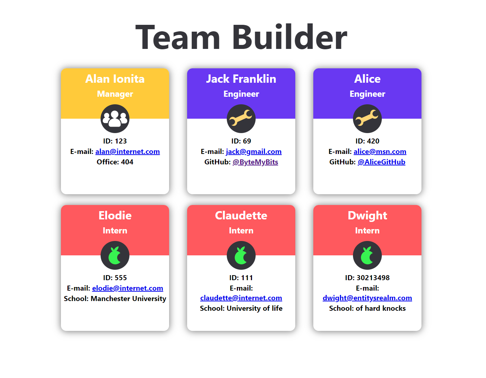

# Team Builder

"What's our office number, again?"

"I wish I could remember my employee ID."

"What's the boss called?!"

Are these the kind of questions you find yourself asking? Then look no further -- this repository demonstrates an app that will produce a spiffy webpage with all your team's details. You can print it off and pin it to the wall. 

Never forget your colleagues' names again!

## How does it work?

It uses an npm module called Inquirer to take input from the command line and builds up a .html page using template literals. It also uses Jest to run tests.

## How do I use it?

Clone this repo, then using the command line run _npm install_ followed by _npm start_.

## Finished product

You can find a walkthrough video demonstrating how the app works [here](https://drive.google.com/drive/folders/1CIL6pnxwV-dkNB1mvQBBQdhCSlnBekPe?usp=sharing).

